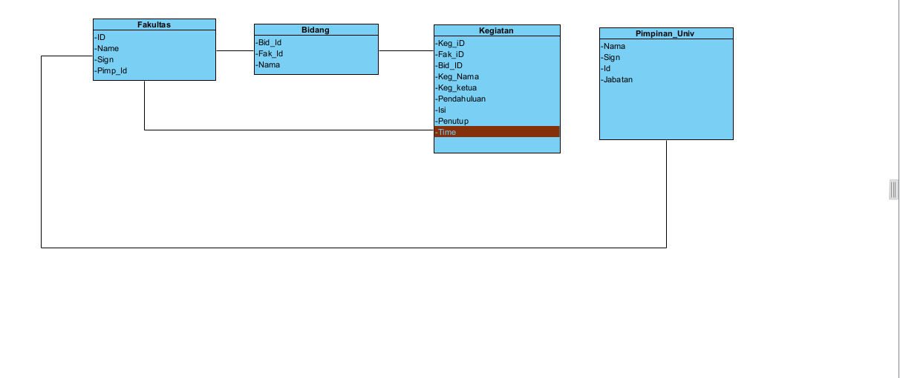

# theForm
the form adalah generator LPJ otomatis

## cara install
1. install git [download git dulu](https://git-scm.com/downloads)
2. install node.js  [download node.js dulu](https://nodejs.org/en/download/)
3. buat folder `ex: mkdir d:\theform\`
4. lalu cd ke folder tersebut `cd theform` 
5. clone repo ini dengan `git clone https://github.com/ahsanu123/theForm.git`
6. masuk ke folder repo dan jalankan `npm install`
7. lalu coba jalankan dengan `npm run dev`
8. DONE

## LOG
| DATE                 | Aaron                                 |   Ahsanu                             | Igo      |
| :----:               | :---                                  | :---                                 | :---     |
| Rabu 3 Agustus 2022 | riset cara bikin buletin & numbering  | pendahuluan dan isi dimasukan ke pdf | Kop surat|

## TODO --> DL: 24 Agustus 2022
- [x] Submit buat ngeprint (AH)
- [ ] Database (AH)
- [x] Mbuat UI designer (Aaron)
- [ ] Benerin Front End sesuai diagram (Igo)
- [ ] Text processing (buat kayak enter dll) --> reg ex bahasa T-rex. (Igo, Aaron)

## JOB SCOPE
| DATE                 | Aaron                                 |   Ahsanu                                | Igo      |
| :----:               | :---                                  | :---                                    | :---     |
| Minggu, 28 Agustus 2022 | Mbuat Text Processing                 | 1. List Top-ten             | 1. Benerin Front End sesuai diagram         |
|                      |                                       | 2. Connect ke List          |                                             |

Progress cek: Minggu, 4 September 2022
